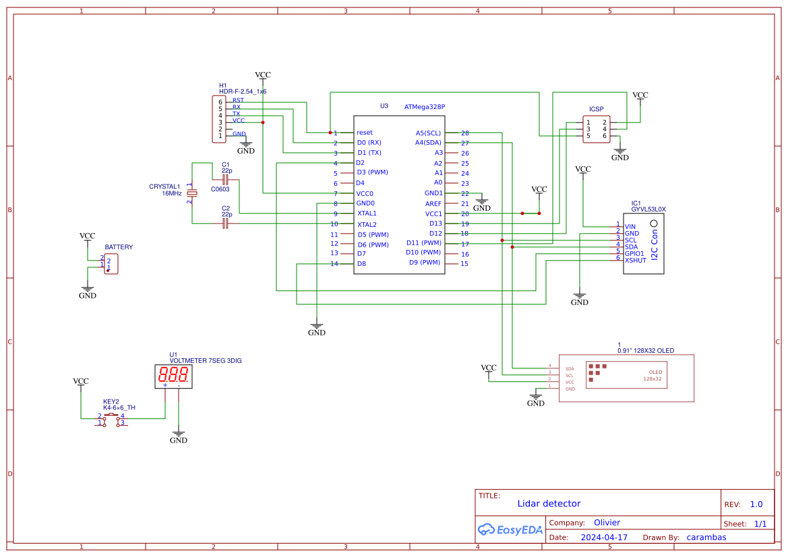
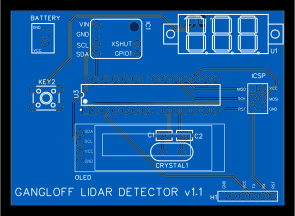

# arduino-lidar-detector

## Circuit : 
- ATMEGA328P
- Lidar : VL53LDK (basé sur puce VL53L0X)
- Oled Screen
- Bouton + voltmètre pour mesurer la tension de la batterie lorsque le bouton est pressé
- Connecteurs à des fins de test :
  - RX/TX pour une programmation du microcontrolleur par liaison série
  - ICSP, là aussi pour programmer le microcontrôleur (et le flasher)
  
**Schéma**  

**Vue du PCB**  

## Programme du microcontrolleur
Le microcontrolleur se met en veille dès que possible avec 2 modes de fonctionnement :
- par défaut : veille + VL53L0X configuré pour effectuer une mesure par seconde. Réveil si objet proche
- objet détecté : veille + VL53L0X conguré por effectuer une mesure toutes les 50 ms

### Setup
- Après initialisation de l'écran OLED : affichage de "00"
- Après initiallisation de la puce VL53L0X, affichage de "11"
- Mise en place de l'interruption liée au VL53L0X pour réveiller le microcontrolleur

### Boucle
- On se met en veille (après avoir éteind l'écran si plus de 3 mesures sans rien détecter)
- On est réveillé et on fait une mesure qu'on affiche sur l'écran OLED

